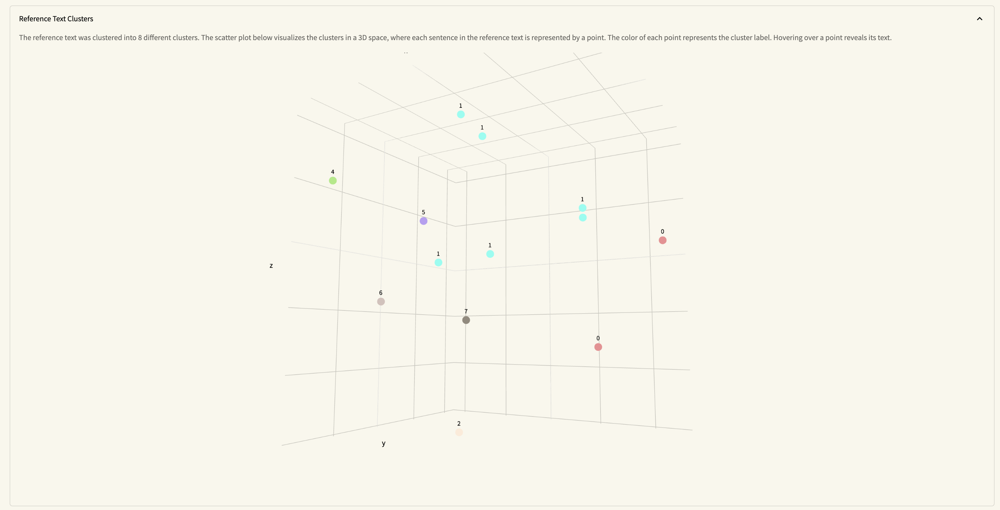

# MISEM

MISEM – a **m**ultifaceted **i**nterpretable **s**ummary **e**valuation
**m**ethod *(insert arXiv URL)*. This repository provides both the code for the method itself and the accompanying interpretability toolbox.


## Screenshots





## Installation

Go to the project directory

```bash
cd misem
```
via Poetry (https://python-poetry.org/)

```bash
poetry install
```
    

## Run Locally

### Run Backend

From main directory, go to the app directory

```bash
cd app
```

Start the server

```bash
uvicorn main:app --reload
```

### Run Frontend

From main directory, start the streamlit frontend application

```bash
streamlit run view.py
```

## Acknowledgements

We would like to thank the following people for our cooperation:

 - Richard Osuala
 - Marcell Streile
 - Andrea Giovannini
 - Charley Beller

